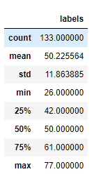
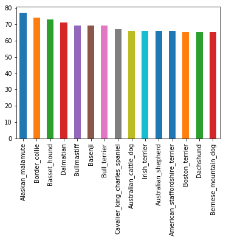

# Dog-Breed-Predictor

## Project Definition
This project lets you train your own dog breed predictor using deep learning and Keras framework and use it on dog images to predict its breed or a human images to get the closest breed to the image, or you can use a pre-trained model existing in saved_models folder with a 82% accuracy accross all dog breeds!!  
The model is then deployed to a web application where you can test your own images!  

## Requirements
python = 3.6  
keras = 2.0.9  
tensorflow = 1.3.0  
opencv = 3.3.1  
pillow = 5.2.0  
h5py = 2.7.1  
flask  
You can download all of these packages using anaconda and conda-forge  

## Analysis
The number of classes that the model can predict is 133 dog breeds. The below stats shows the distribution of the number of labels for each class in the training data  
  
The following visualization shows the number of images for each of the top 15 classes  
  

## How to Run
### Train your own model (optional):
You can follow the steps in the notebook inside src folder.  
### Deploy your model to the web:
After training your model or using the pretrained model found in the saved_models folder, make sure that the model path in DogPredictor inside utils.py is the intended model.  
After that, you can deploy your web app using the command

    python app.py  
Where it will tell you in the terminal the local host (url) it's running on, upload your images and watch the predictions  

## Conclusion
We have trained our own dog breed predictor, then we have deployed it to a web application for us to use it to predict our own images. One area of improvement for the over all accuracy is using more training data, another one is experimenting with different values for the hyperparameters (lr for example).
